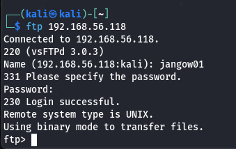
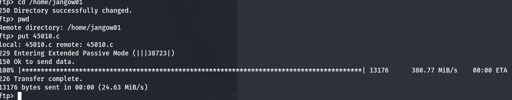
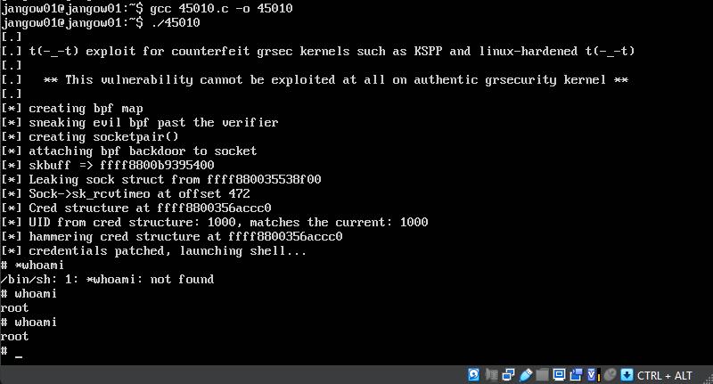

# 🛡️ CyberCerberus: Prima CTF Bonus - BuildWeek2

Benvenuti nel report del Team **CyberCerberus**! Questo documento spiega i passaggi che abbiamo seguito per scoprire e sfruttare le vulnerabilità della macchina **Jangow01**, la prima CTF bonus della BuildWeek2. 💻

## [🏠 HOME](./README.MD)

---

## 🛠️ Configurazione dell'ambiente

1. Configurata una macchina **Kali Linux** con indirizzo IP `192.168.56.103` e la macchina target **Jangow01** con indirizzo IP `192.168.56.118`.
2. Entrambe le macchine sono state impostate su **Scheda Solo Host** in **VirtualBox** per garantire una connessione diretta e isolata.

---

## 🔍 Scoperta delle vulnerabilità

### 1. Scansione iniziale 🔎
Utilizzando un comando **nmap** aggressivo e stealth, abbiamo rilevato che le seguenti porte erano aperte:
- **Porta 21 (FTP)** 🗂️
- **Porta 80 (HTTP)** 🌐

### 2. Accesso FTP anonimo
Abbiamo provato un accesso anonimo al server FTP, ma non è stato trovato nulla di utile.

---

## 🌐 Esplorazione del sito web

### 1. Scoperta del comportamento vulnerabile
Esplorando il sito, ci siamo imbattuti nella funzione **Buscar**, che si è rivelata vulnerabile. Inizialmente abbiamo ipotizzato **SQL Injection** o **XSS**, ma successivamente abbiamo scoperto un vero e proprio **comportamento shell**.

Digitando il comando `whoami` nell'URL, abbiamo ricevuto la risposta:
```
www-data
```

### 2. Esplorazione del filesystem
Abbiamo iniziato a esplorare il filesystem attraverso concatenazioni di comandi. Tuttavia, i tentativi di creare una **reverse shell PHP** per collegarci a un listener `netcat` su Kali Linux (porta 4444) non hanno avuto successo a causa delle limitazioni di input nell'URL.

---

## 📂 Scoperte importanti

### 1. File `users.txt`
Durante l'esplorazione del filesystem, abbiamo trovato un file chiamato `users.txt` contenente una stringa hash MD5. Tuttavia, questo non ci ha portato a risultati utili.

### 2. File `.backup`
Successivamente, ci siamo imbattuti nel file `.backup`, che conteneva credenziali in chiaro:
```php
$username = "jangow01";
$password = "abygurl69";
```

---



## 🔑 Accesso alla macchina

1. Con le credenziali trovate, siamo riusciti ad accedere al server FTP. ✅
2. Inoltre, le stesse credenziali ci hanno permesso di accedere direttamente alla macchina **Jangow01**, anche se non come root. 👤

---

## 🛠️ Escalation dei privilegi

1. Abbiamo verificato la versione del kernel della macchina (`4.4.0-31-generic #50-Ubuntu SMP`).
2. Su **ExploitDB**, abbiamo trovato un exploit locale per l'escalation dei privilegi: **45010.c**.

### Procedura di exploit:
- **Trasferimento del file:** Il file `45010.c` è stato caricato nella directory dell'utente `jangow01` tramite FTP.


- **Compilazione:** Accedendo localmente alla macchina, abbiamo compilato il file con:
  ```bash
  gcc 45010.c -o exploit
  ```
- **Esecuzione:** L'esecuzione dell'exploit ci ha permesso di ottenere una **shell root**. 🎉



---

## 📜 Conclusione

Grazie all'approccio metodico e al lavoro di squadra, siamo riusciti a:
- Scoprire vulnerabilità nel sito web.
- Utilizzare credenziali per accedere sia al server FTP che alla macchina target.
- Effettuare l'escalation dei privilegi per ottenere l'accesso root.

Il percorso è stato impegnativo ma ci ha permesso di migliorare le nostre capacità di analisi e risoluzione di problemi. 🚀

---

**CyberCerberus** 🛡️ | [BuildWeek2 CTF Bonus - Jangow01]

## [🏠 HOME](./README.MD)
